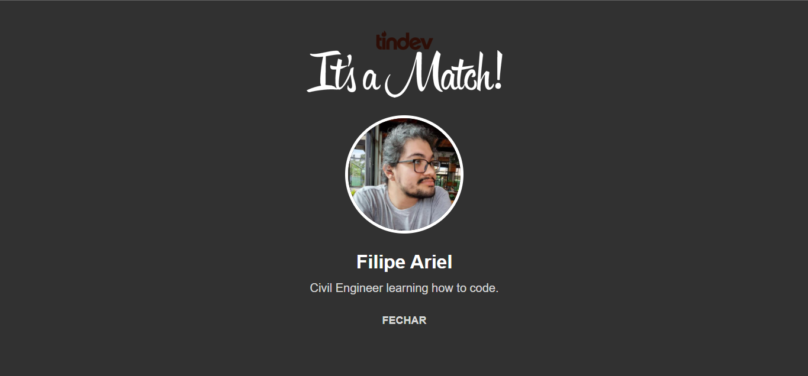

<h1 align="center">
   
  
   
   
  Tindev
</h1>

Este repositório é um clone do app Tinder versão Mobile e Desktop, entitulado <strong>TinDev</strong>

  

## Tecnoglogias

Esse projeto foi desenvolvido com as seguintes tecnologias:

- ⚛️ **React Js**
- ⚛️ **React Native**
- 💹 **Node Js**
- 📄 **MongoDB**
- ♻️ **Socket IO**

## Projeto

O TinDev é uma plataforma criada para conectar devs de forma eficiente, utilizando a API do Github para cadastrar
usuário no aplicativo

## Agradecimentos

Um super obrigado à <a href="https://github.com/rocketseat-education">Rocketseat Education</a> por disponibilizar mais
esse conteúdo de qualidade aos seus estudantes!!!

---

Feito com ♥ by Filipe Ariel
